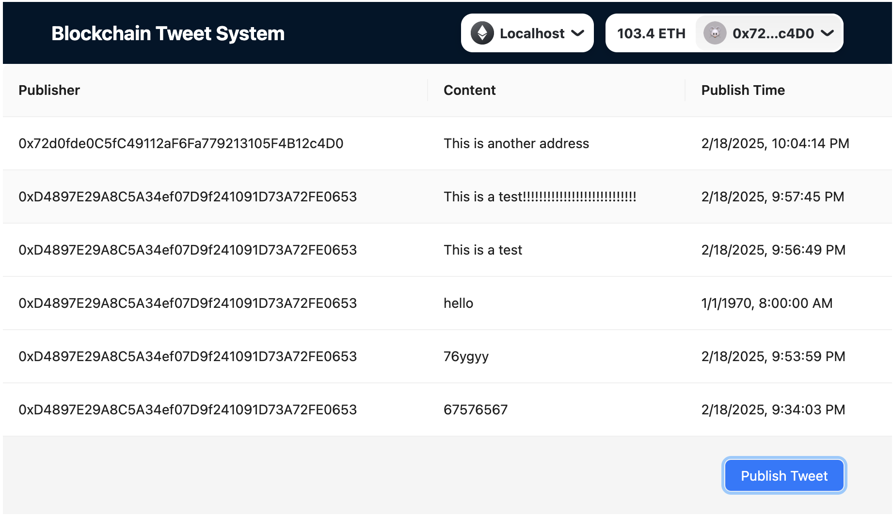
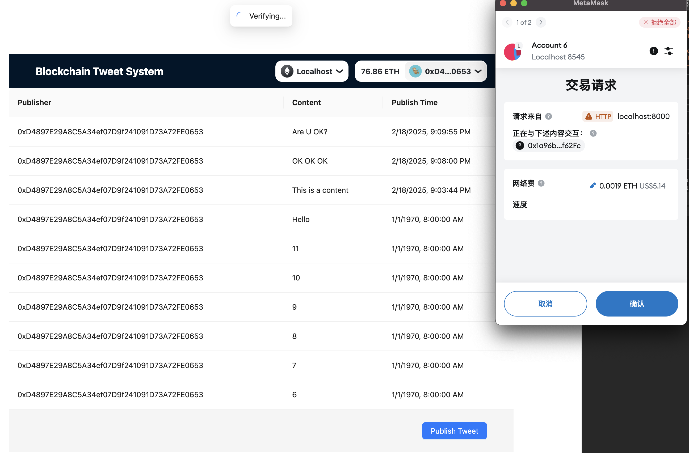

# ETH-batch-transfer-ethers

## Tech Stack


## Description
This is an project that supports:

I. ETH | ERC20 batch transfer 
1. balance inquiry
2. initiating transfers
3. viewing transaction results

ETH

ERC20


II. HD Wallet Management
1. HD wallet generation
2. HD wallet balance inquiry
3. HD wallet address and private key shown


III. Blockchain Tweet System
1. tweet contract
2. loading tweet list
3. listening tweet events



## Getting Started
First, run the development server:
```bash
pnpm run dev
```
Open [http://localhost:8000](http://localhost:8000) with your browser to see the result.

## Deploy
```bash
umi build
```
Project will be generated under './dist' folder:
```bash
./dist
├── index.html
├── umi.css
└── umi.js
```